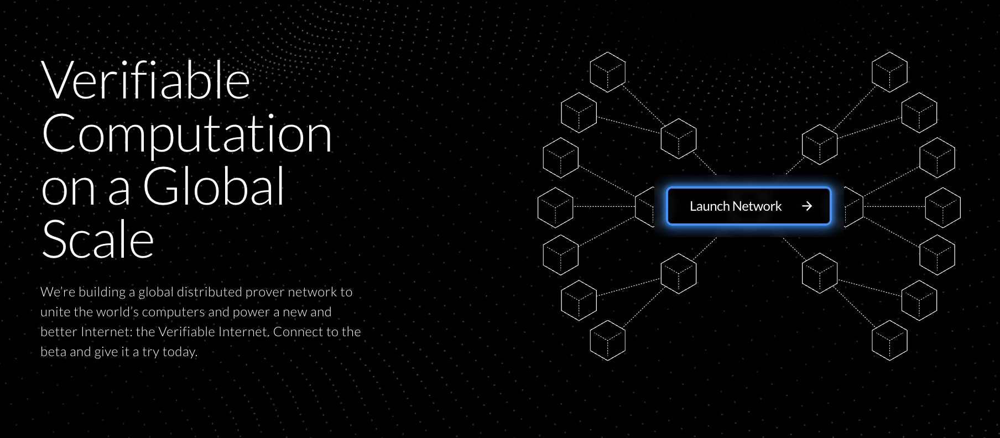

[](https://github.com/nexus-xyz/network-api/releases)
[](https://github.com/nexus-xyz/network-api/blob/main/LICENSE-APACHE)
[](https://github.com/nexus-xyz/network-api/blob/main/LICENSE-MIT)

# Nexus Network CLI

A high-performance command-line interface for contributing proofs to the Nexus network.

<figure>
    <a href="https://beta.nexus.xyz/">
        
    </a>
    <figcaption>
        <strong>Verifiable Computation on a Global Scale</strong><br>
        We're building a global distributed prover network to unite the world's computers and power a new and better Internet: the Verifiable Internet. Connect to the beta and give it a try today.
    </figcaption>
</figure>

## The Nexus Network

The [Nexus Network](https://docs.nexus.xyz/network) is a global distributed prover network that unites the world's computers to power a new and better Internet: the Verifiable Internet.

There have been several testnets so far:
- Testnet 0: [October 08 – 28, 2024](https://blog.nexus.xyz/nexus-launches-worlds-first-open-prover-network/)
- Testnet I: [December 9 – 13, 2024](https://blog.nexus.xyz/the-new-nexus-testnet-is-live/)
- Testnet II: [February 18 – 22, 2025](https://blog.nexus.xyz/testnet-ii-is-open/)

---

## Quick Start

### Single-User Installation

For the simplest one-command install (especially for local testing or personal use). This is what most users will want to do:

```bash
curl https://cli.nexus.xyz/ | sh
```

**Note:** This script automatically installs Rust if you don’t have it and prompts for Terms of Use in an interactive shell.

Alternatively, if you’ve already downloaded `install.sh`:

```bash
./install.sh
```

### CI

The `install.sh` script is designed to do several things:


1. Install Rust if it's not already installed... and do it non-interactively if possible, so it does not bother the user.
2. Prompt the user to accept the Terms of Use (via bash) and enter their node id (via the Rust program)

```sh
# this is the part in the install.sh script has the brittle `< /dev/tty` part within CI environments
(
  cd "$REPO_PATH/clients/cli" || exit
  cargo run --release -- start --env beta
) < /dev/tty
```


This combination of bash and Rust is a bit brittle in CI environments. Consider these approaches instead:

1. **Build from source**:
   ```bash
   git clone https://github.com/nexus-xyz/network-api
   cd network-api/clients/cli
   cargo build --release
   ./target/release/nexus-network start --env beta
   ```
2. **Download the script locally** (and optionally set `NONINTERACTIVE=1` if you need it to run without prompts):
   ```bash
   curl -sSf https://cli.nexus.xyz/ -o install.sh
   chmod +x install.sh
   NONINTERACTIVE=1 ./install.sh
   ```

Building from source or running a downloaded script gives you more control over dependencies and versions, and avoids any unexpected prompts during automated runs.

---

## Local Testing with a Local HTTP Server

If you want to simulate `curl https://cli.nexus.xyz/ | sh` **locally**:

1. In the project’s root directory, start a local server:
   ```sh
   python3 -m http.server 8080
   ```
2. In a separate terminal, run:
   ```sh
   curl -sSf http://localhost:8080/public/install.sh | sh -x
   ```
3. Observe the script output and verify installation logic.

If you don’t have Rust installed, you will be prompted to install it (unless `NONINTERACTIVE=1` is set).

---

## Prerequisites

### Linux

```bash
sudo apt update && sudo apt upgrade
sudo apt install build-essential pkg-config libssl-dev git-all protobuf-compiler
```

### macOS

```bash
brew install git
```

### Windows

1. [Install WSL](https://learn.microsoft.com/en-us/windows/wsl/install).  
2. Follow the Linux instructions above within WSL.

---

## Terms of Use

Use of the CLI is subject to the [Terms of Use](https://nexus.xyz/terms-of-use). First-time users running interactively will be prompted to accept these terms. For **non-interactive acceptance** (e.g., in CI), run:

```bash
NONINTERACTIVE=1 sh install.sh
```

or set `NONINTERACTIVE=1` before invoking the script.

---

## Node ID

During the CLI’s startup, you’ll be asked for your node ID. To skip prompts in a
non-interactive environment, manually create a `~/.nexus/config.json` in the
following format:

```json
{
   "node_id": "<YOUR NODE ID>"
}
```

---

## Current Limitations

- Only the latest CLI version is supported.
- No prebuilt binaries yet.
- To submit programs to the network for proving, contact [growth@nexus.xyz](mailto:growth@nexus.xyz).

---

## Get Help

- [Network FAQ](https://docs.nexus.xyz/layer-1/network-devnet/faq)  
- [Discord Community](https://discord.gg/nexus-xyz)  
- Technical issues? [Open an issue](https://github.com/nexus-xyz/network-api/issues)

---

## Repository Structure

```txt
network-api/
├── assets/       # Media for documentation
├── clients/
│   └── cli/      # Main CLI implementation
├── proto/        # Shared network interface definition
└── public/       # Files hosted at cli.nexus.xyz
```

---

## Contributing

See [CONTRIBUTING.md](./CONTRIBUTING.md) for development setup and guidelines.
