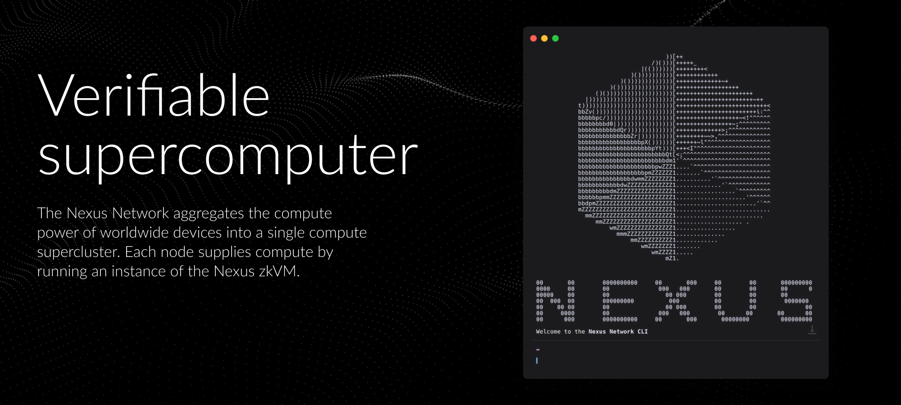

[](https://github.com/nexus-xyz/network-api/blob/main/LICENSE-APACHE)
[](https://github.com/nexus-xyz/network-api/blob/main/LICENSE-MIT)
[](https://github.com/nexus-xyz/network-api/actions/workflows/ci.yml)
[](https://crates.io/crates/nexus-network)

# Nexus Network CLI

A high-performance command-line interface for contributing proofs to the Nexus network.

<figure>
    <a href="https://beta.nexus.xyz/">
        
    </a>
    <figcaption>
        <strong>Verifiable Computation on a Global Scale</strong><br>
        We're building a global distributed prover network to unite the world's computers 
        and power a new and better Internet: the Verifiable Internet. Connect to the beta 
        and give it a try today.
    </figcaption>
</figure>

## The Nexus Network

The [Nexus Network](https://docs.nexus.xyz/network) is a global distributed prover 
network that unites the world's computers to power a new and better Internet: the 
Verifiable Internet.

There have been two testnets so far:
- Testnet 0: [October 08 – 28, 2024](https://blog.nexus.xyz/nexus-launches-worlds-first-open-prover-network/)
- Testnet I: [December 9 – 13, 2024](https://blog.nexus.xyz/the-new-nexus-testnet-is-live/)
- Testnet II: [February 18 – 22, 2025](https://blog.nexus.xyz/testnet-ii-is-open/)

---

## Quick Start

### Installation

#### Precompiled Binary (Recommended)

For the simplest and most reliable installation:

```bash
curl https://cli.nexus.xyz/ | sh
```

This will:
1. Download and install the latest precompiled binary for your platform
2. Prompt you to accept the Terms of Use
3. Start the CLI in interactive mode

### Non-Interactive Installation

For automated installations (e.g., in CI):

```bash
curl -sSf https://cli.nexus.xyz/ -o install.sh
chmod +x install.sh
NONINTERACTIVE=1 ./install.sh
```

---

## Terms of Use

Use of the CLI is subject to the [Terms of Use](https://nexus.xyz/terms-of-use). 
First-time users running interactively will be prompted to accept these terms.

---

## Node ID

During the CLI's startup, you'll be asked for your node ID. To skip prompts in a
non-interactive environment, manually create a `~/.nexus/config.json` in the
following format:

```json
{
   "node_id": "<YOUR NODE ID>"
}
```

---

## Current Limitations

- To submit programs to the network for proving, contact 
  [growth@nexus.xyz](mailto:growth@nexus.xyz).

---

## Get Help

- [Network FAQ](https://docs.nexus.xyz/layer-1/network-devnet/faq)  
- [Discord Community](https://discord.gg/nexus-xyz)  
- Technical issues? [Open an issue](https://github.com/nexus-xyz/network-api/issues)

---

## Contributing

Interested in contributing to the Nexus Network CLI? Check out our 
[Contributor Guide](./CONTRIBUTING.md) for:

- Development setup instructions
- How to report issues and submit pull requests
- Our code of conduct and community guidelines
- Tips for working with the codebase

For most users, we recommend using the precompiled binaries as described above. 
The contributor guide is intended for those who want to modify or improve the CLI 
itself.
